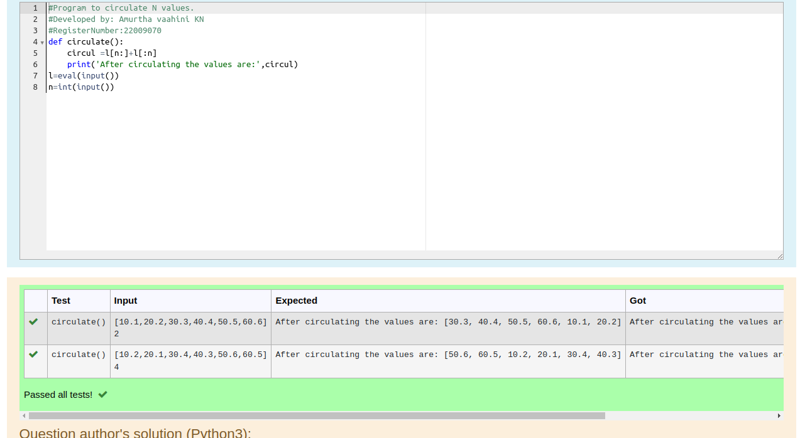

# Circulate-the-values-of-N-variables
## Aim:
To write a python program to circulate the n variables using function concept
## Equipment’s required:
PC
Anaconda - Python 3.7
## Algorithm: 
### Step 1: 
Get the values from the user
### Step 2: 
Do the operations given
### Step 3: 
Get the value from the user for the number of rotation
### Step 4: 
Using the slicing concept rotate the list
### Step 5: 
End the program
## Program:
```python
#Program to circulate N values.
#Developed by: Amurtha vaahini KN
#RegisterNumber:22009070
def circulate():
    circul =l[n:]+l[:n]
    print('After circulating the values are:',circul)
l=eval(input())    
n=int(input())
```
## Output:



## Result:
Thus the circulate the values of N variables are successfully executed.